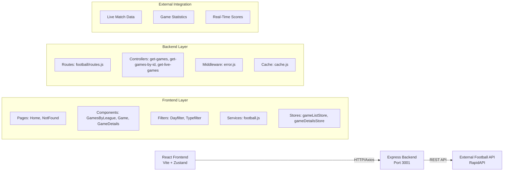
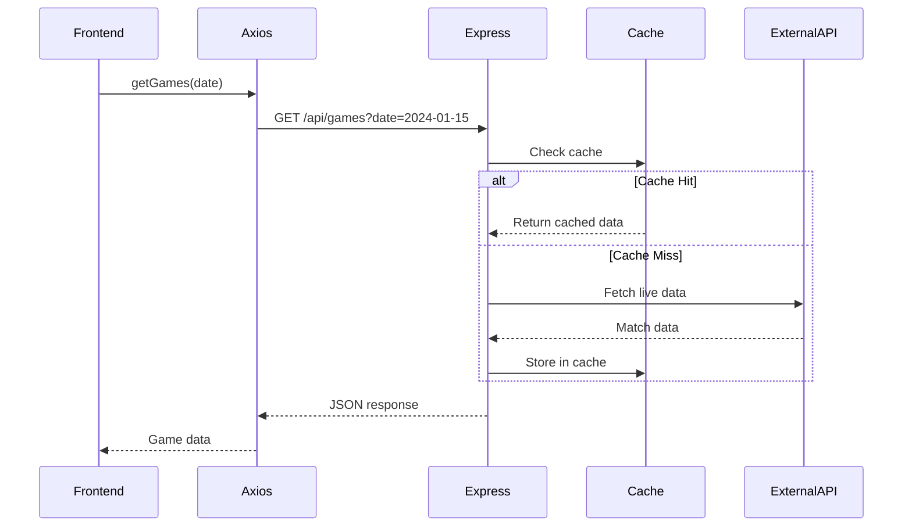

# The Footy Page -  Documentation

## 📋 Overview

The Footy Page is a full-stack web application that provides real-time football match information, scores, and statistics. The application follows a modern three-tier architecture with a React-based frontend, Express.js backend, and integration with external football data APIs.

## 🏗️ Architecture Diagram



## 🎨 Frontend Layer

### Technology Stack
- **Framework**: React 19
- **Build Tool**: Vite
- **State Management**: Zustand
- **Routing**: React Router
- **HTTP Client**: Axios
- **Styling**: Stylus (CSS preprocessor)
- **Icons**: Lucide React, React Icons

### Pages

| Page | Path | Description |
|------|------|-------------|
| **Home** | `/`, `/home` | Main landing page displaying live and upcoming football matches with date filtering |
| **NotFound** | `*` | 404 error page for undefined routes |

### Components

| Component | Location | Description |
|-----------|----------|-------------|
| **Header** | `header/index.jsx` | "The Footy Page" branding header with logo alignment and responsive design |
| **Footer** | `footer/index.jsx` | Application footer with additional links and information |
| **GamesByLeague** | `components/GamesByLeague/` | Groups and displays football games organized by leagues |
| **Game** | `components/Game/` | Individual game card showing teams, scores, and match status with symmetrical layout |
| **GameDetails** | `components/GameDetails/` | Detailed statistics view for matches with team performance data |
| **Dayfilter** | `components/Dayfilter/` | Date navigation component for browsing matches across different days |
| **Typefilter** | `components/Typefilter/` | Borderless button filter for switching between match types with rounded border container |
| **SkeletonLoading** | `components/SkeletonLoading/` | Loading placeholder component for better UX while fetching data |

### State Management (Zustand)

| Store | File | Purpose |
|-------|------|---------|
| **gameListStore** | `stores/gameListStore.js` | Manages list of games, date selection, and match type filters |
| **gameDetailsStore** | `stores/gameDetailsStore.js` | Handles detailed game statistics and fixture-specific data |

### Services

**Football Service** (`services/football.js`)
```javascript
// Axios-based API client
getGames(date)           // Fetch games for a specific date
getGamesById(id)         // Fetch detailed statistics for a fixture
```

## 🔌 API Communication

The frontend communicates with the backend through REST API endpoints using Axios.

### API Endpoints

| Method | Endpoint | Description | Parameters |
|--------|----------|-------------|------------|
| **GET** | `/api/games` | Fetch football games for a specific date | `?date={YYYY-MM-DD}` |
| **GET** | `/api/games/statistics` | Get detailed statistics for a specific game | `?fixture={id}` |
| **GET** | `/api/games/live` | Retrieve currently live matches with real-time scores | None |

### Request Flow



## ⚙️ Backend Layer

### Technology Stack
- **Framework**: Express.js
- **Runtime**: Node.js
- **HTTP Client**: Axios (for external API calls)
- **Middleware**: CORS, custom error handling

### Server Configuration

**Main Server** (`src/server.js`)
- Runs on port **3001**
- CORS enabled for frontend communication
- JSON body parsing
- Centralized error handling

### Route Structure

```
/api
├── /games              → Get games by date
├── /games/live         → Get live matches
└── /games/statistics   → Get game statistics by fixture ID
```

**Routes Implementation** (`routes/football/routes.js`)
```javascript
router.get('/games', getGames)
router.get('/games/live', getLiveGames)
router.get('/games/statistics', getGamesById)
```

### Controllers

| Controller | Location | Responsibility |
|------------|----------|----------------|
| **get-games** | `controllers/football/get-games/` | Fetches games by date with request validation schema |
| **get-games-by-id** | `controllers/football/get-games-by-id/` | Retrieves detailed game statistics by fixture ID |
| **get-live-games** | `controllers/football/get-live-games/` | Returns currently live matches with validation |

Each controller includes:
- `index.js` - Main controller logic
- `schema.js` - Request validation schema

### Middleware

| Middleware | File | Purpose |
|------------|------|---------|
| **errorHandler** | `middleware/error.js` | Centralized error handling for all routes |
| **unknownEndpoint** | `middleware/error.js` | Handles requests to undefined endpoints |
| **CORS** | Built-in | Enables cross-origin requests from frontend |

### Caching Layer

**Cache Library** (`lib/cache.js`)
- Optimizes API responses
- Reduces external API calls
- Improves response times

## 🌐 External Integration

### Football Data Provider

The backend integrates with a third-party football data API (likely **API-Football** via **RapidAPI**) to fetch:

- **Live match data** - Real-time scores and match events
- **Game statistics** - Detailed team and player statistics
- **Fixture information** - Upcoming matches, kickoff times
- **League data** - Competition information and standings

### Data Flow

1. **Frontend Request**: User interacts with UI (e.g., selects a date)
2. **API Call**: Frontend calls backend via Axios
3. **Cache Check**: Backend checks if data is cached
4. **External Fetch**: If not cached, fetch from external API
5. **Data Transform**: Backend processes and validates data
6. **Response**: Send formatted data to frontend
7. **UI Update**: Frontend updates via Zustand stores

## 📦 Technology Stack Summary

### Frontend
- ⚛️ React 19
- ⚡ Vite (Build tool)
- 🐻 Zustand (State management)
- 🛣️ React Router (Routing)
- 📡 Axios (HTTP client)
- 💅 Stylus (CSS preprocessor)
- 🎨 Lucide Icons (UI icons)

### Backend
- 🚀 Express.js
- 🟢 Node.js
- 📡 Axios (External API calls)
- ⚡ Cache library (Performance optimization)

### External Services
- ⚽ Football Data API (RapidAPI)

## 🚀 Getting Started

### Prerequisites
- Node.js (v18+)
- npm or yarn

### Installation

1. **Install dependencies**:
```bash
# Frontend
cd frontend
npm install

# Backend
cd backend
npm install
```

2. **Configure environment variables**:

Frontend (`.env`):
```env
VITE_API_URL=http://localhost:3001/api
```

Backend (`.env`):
```env
# Add your football API credentials here
```

3. **Run the application**:

```bash
# Backend (Terminal 1)
cd backend
npm start

# Frontend (Terminal 2)
cd frontend
npm run dev
```

4. **Access the application**:
- Frontend: `http://localhost:5173`
- Backend: `http://localhost:3001`

## 📁 Project Structure

```
football-app/
├── frontend/
│   ├── src/
│   │   ├── pages/           # Route pages (Home, NotFound)
│   │   ├── components/      # Reusable UI components
│   │   ├── header/          # Header component
│   │   ├── footer/          # Footer component
│   │   ├── stores/          # Zustand state stores
│   │   ├── services/        # API service layer
│   │   ├── utils/           # Utility functions
│   │   ├── constants/       # Constants and configs
│   │   ├── App.jsx          # Main app component
│   │   └── main.jsx         # Entry point
│   ├── package.json
│   └── vite.config.js
├── backend/
│   ├── src/
│   │   ├── controllers/     # Route controllers
│   │   │   └── football/    # Football-specific controllers
│   │   ├── routes/          # API route definitions
│   │   │   └── football/    # Football routes
│   │   ├── middleware/      # Custom middleware
│   │   ├── lib/             # Libraries (cache)
│   │   └── server.js        # Express server
│   ├── package.json
│   └── vercel.json
└── architecture-diagram.html  # Visual architecture diagram
```

## 🔒 Security Considerations

> [!WARNING]
> Ensure API keys for external football data services are stored securely in environment variables and never committed to version control.

## 📈 Performance Optimizations

- **Caching**: Backend caching reduces redundant API calls
- **Lazy Loading**: Components load on demand
- **Skeleton Loading**: Improves perceived performance
- **State Management**: Zustand provides efficient state updates

## 🤝 Contributing

When contributing to this project, please ensure:
- Follow the existing code structure
- Add appropriate validation schemas for new endpoints
- Update this documentation for architectural changes
- Test both frontend and backend changes

---

**The Footy Page** - Real-time football match information at your fingertips ⚽
